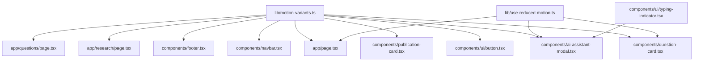

# Design Document: Site-Wide Interactivity

## Overview

This document covers the technical design for elevating the Tour research platform from a static information display to a lively, polished interactive experience. The implementation layers Framer Motion v11.3.8 variants and Tailwind CSS utilities across every major UI surface without introducing new libraries or altering the existing design-token system.

The design strategy has three tiers:

1. **CSS-only micro-animations** — hover color and shadow changes handled entirely by Tailwind hover variants (zero JS overhead, zero layout shift).
2. **Framer Motion component-level interactions** — `whileHover`, `whileTap`, and `AnimatePresence` manage spring/ease transitions that CSS alone cannot express (scale, layout transitions, unmounting animations).
3. **Framer Motion scroll-triggered entrance animations** — `whileInView` / `useInView` reveals page sections as they enter the viewport.

All three tiers respect the `prefers-reduced-motion` media query. Tailwind handles CSS-level suppression via the existing `globals.css` `@media (prefers-reduced-motion: reduce)` rule. Framer Motion components use the `useReducedMotion()` hook to zero out `x`, `y`, `scale`, and `rotate` values while preserving `opacity` changes.

---

## Architecture

### Motion Abstraction Layer

Rather than sprinkling raw Framer Motion primitives throughout every component, shared variant factories and a central `motion-variants.ts` module keep durations and easings consistent. Components import named variant presets; the presets enforce the 150–300 ms duration window and the `easeOut`/`easeIn` convention from Requirement 8.

```
lib/
  motion-variants.ts      ← shared Framer Motion variant objects + helpers
  use-reduced-motion.ts   ← thin wrapper re-exporting Framer Motion's hook
components/
  ui/
    button.tsx            ← upgraded with whileHover + whileTap
    typing-indicator.tsx  ← new: three-dot animated indicator
  publication-card.tsx    ← upgraded
  question-card.tsx       ← upgraded + useState like logic
  navbar.tsx              ← AnimatePresence drawer + link whileHover
  footer.tsx              ← link group with translateX + arrow reveal
  ai-assistant-modal.tsx  ← AnimatePresence modal + typing indicator
app/
  page.tsx                ← entrance animations on all sections
  research/page.tsx       ← filter pill animated state + card hover
  questions/page.tsx      ← filter pill animated state
```

### Dependency Flow



---

## Components and Interfaces

### `lib/motion-variants.ts`

Central export of all shared variant definitions and transition presets.

```ts
import type { Variants, Transition } from "framer-motion";

/** Reusable transition presets */
export const tEnter: Transition = { duration: 0.2, ease: "easeOut" };
export const tExit: Transition  = { duration: 0.15, ease: "easeIn" };
export const tSlow: Transition  = { duration: 0.25, ease: "easeOut" };

/** Card hover — wrapper scale lift */
export const cardVariants: Variants = {
  rest: { scale: 1 },
  hover: { scale: 1.01, transition: tEnter },
};

/** Generic fade + slide up entrance (hero elements, CTA) */
export function fadeUpVariants(yOffset = 20, duration = 0.6): Variants {
  return {
    hidden: { opacity: 0, y: yOffset },
    visible: { opacity: 1, y: 0, transition: { duration, ease: "easeOut" } },
  };
}

/** Stagger container */
export function staggerContainer(staggerChildren: number, delayChildren = 0): Variants {
  return {
    hidden: {},
    visible: { transition: { staggerChildren, delayChildren } },
  };
}

/** Modal panel enter/exit */
export const modalVariants: Variants = {
  hidden: { opacity: 0, scale: 0.95 },
  visible: { opacity: 1, scale: 1, transition: tSlow },
  exit:    { opacity: 0, scale: 0.95, transition: { duration: 0.2, ease: "easeIn" } },
};

/** Backdrop */
export const backdropVariants: Variants = {
  hidden: { opacity: 0 },
  visible: { opacity: 1, transition: tEnter },
  exit:    { opacity: 0, transition: tExit },
};

/** Mobile drawer */
export const drawerVariants: Variants = {
  hidden: { opacity: 0, y: -8 },
  visible: { opacity: 1, y: 0, transition: { duration: 0.25, ease: "easeOut" } },
  exit:    { opacity: 0, y: -8, transition: { duration: 0.2, ease: "easeIn" } },
};

/** Message bubble entrance */
export const messageBubbleVariants: Variants = {
  hidden: { opacity: 0, y: 8 },
  visible: { opacity: 1, y: 0, transition: tEnter },
};

/** Section header slide-in from left */
export const sectionHeaderVariants: Variants = {
  hidden: { opacity: 0, x: -12 },
  visible: { opacity: 1, x: 0, transition: { duration: 0.4, ease: "easeOut" } },
};

/** Step icon entrance (scale up) */
export const stepIconVariants: Variants = {
  hidden: { opacity: 0, scale: 0.8 },
  visible: { opacity: 1, scale: 1, transition: { duration: 0.4, ease: "easeOut" } },
};

/** Heart bounce keyframe sequence (used imperatively via useAnimate) */
export const heartBounceSequence = [
  [{ scale: 1.4 }, { duration: 0.15, ease: "easeOut" }],
  [{ scale: 1.0 }, { duration: 0.1, ease: "easeIn" }],
] as const;

/** Reduced-motion override: zero out all geometric transforms */
export function reducedMotionVariant<T extends Variants>(variants: T): T {
  const result = {} as T;
  for (const key of Object.keys(variants) as Array<keyof T>) {
    result[key] = {
      ...(variants[key] as object),
      x: 0, y: 0, scale: 1, rotate: 0,
    };
  }
  return result;
}
```

### `components/ui/typing-indicator.tsx`

A new micro-component rendering three animated dots indicating AI is composing a response.

```tsx
"use client";
import { motion } from "framer-motion";

const dotVariants = {
  bounce: (i: number) => ({
    y: [0, -6, 0],
    transition: { delay: i * 0.15, duration: 0.5, repeat: Infinity, ease: "easeInOut" },
  }),
};

export function TypingIndicator() {
  return (
    <div className="flex items-center gap-1 px-4 py-3">
      {[0, 1, 2].map((i) => (
        <motion.span
          key={i}
          custom={i}
          variants={dotVariants}
          animate="bounce"
          className="h-2 w-2 rounded-full bg-navy/40"
        />
      ))}
    </div>
  );
}
```

**Props:** none. Rendered in the AI message stream when `isTyping === true`.

### `components/question-card.tsx` — Interactive Like State

The component must become a Client Component (`"use client"`) to manage local `useState` for the liked status and count.

```ts
interface LikeState {
  isLiked: boolean;
  count: number;
}
// Initialized from props: { isLiked: false, count: q.likes }
```

The heart icon switches between an outlined `Heart` (default) and a filled representation via a conditional `fill` and `stroke` CSS prop. Framer Motion's `useAnimate()` hook drives the bounce sequence imperatively on click.

### `components/footer.tsx` — Link Group Pattern

Each column link becomes a Framer Motion `motion.a` (wrapping `next/link`) with:
- `whileHover={{ x: 3 }}` for the nudge
- An inline `motion.span` for the `→` arrow with `initial={{ opacity: 0 }}` / `whileHover={{ opacity: 1 }}`

Since the footer link group repeats identically for all three columns, a `FooterLinkItem` sub-component encapsulates the logic and receives `{ href, label }` props.

### `components/navbar.tsx` — AnimatePresence Drawer

The `{mobileOpen && <div>…</div>}` conditional is replaced with `AnimatePresence` wrapping a `motion.div` that uses `drawerVariants`. This ensures the exit animation plays before the element is removed from the DOM (Requirement 5.5).

Desktop link pills receive `whileHover={{ scale: 1.02 }}` only when not in active state (no transform on active links per Requirement 5.2).

### `components/ai-assistant-modal.tsx` — AnimatePresence Modal

The `{open && <div>…</div>}` is refactored into `AnimatePresence` + `motion.div` for both the backdrop and the panel. A new `isTyping` boolean state controls whether `TypingIndicator` is rendered in the message stream between the user's message being added and the `setTimeout` reply arriving.

### `app/page.tsx` — Landing Page Entrance Animations

The page remains a Server Component for SEO but each animated section is extracted into small Client Component wrappers (e.g., `<HeroSection>`, `<WhyTourSection>`) that own their own `motion.*` elements and `useInView` / `whileInView` calls. This avoids converting the entire page to a Client Component.

### `app/research/page.tsx` and `app/questions/page.tsx` — Filter Pill Animation

The `className` string ternary on filter pills is replaced with Framer Motion `motion.button` and `animate` prop driven by the selected state, so the background/color transition is handled by Framer Motion's layout animation engine rather than a plain CSS `transition`.

---

## Data Models

### Like State (QuestionCard)

```ts
// Local component state — no persistence
interface QuestionLikeState {
  isLiked: boolean;   // toggled on click
  count: number;      // derived from props.likes, mutated locally
}
```

Initialization:

```ts
const [likeState, setLikeState] = useState<QuestionLikeState>({
  isLiked: false,       // fresh session — not liked by default
  count: props.likes,   // seeded from prop
});
```

### AI Modal State

```ts
interface AIModalState {
  open: boolean;
  input: string;
  isTyping: boolean;   // NEW — drives TypingIndicator render
  messages: Array<{ role: "user" | "assistant"; text: string }>;
}
```

`isTyping` transitions: `false → true` immediately after the user message is appended; `true → false` when the simulated reply is appended inside the `setTimeout` callback.

### Animation Variant Registry (conceptual)

No new runtime data model is needed. The `motion-variants.ts` module acts as a static registry. Components import named variants rather than defining inline objects, ensuring a single source of truth for all timing values.

---

## Correctness Properties

*A property is a characteristic or behavior that should hold true across all valid executions of a system — essentially, a formal statement about what the system should do. Properties serve as the bridge between human-readable specifications and machine-verifiable correctness guarantees.*

### Property 1: Like toggle round-trip restores original count

*For any* QuestionCard rendered with any non-negative integer `likes` prop, clicking the heart to like and then clicking again to unlike SHALL result in the displayed like count returning to its original value and the heart returning to its unfilled state.

**Validates: Requirements 2.1, 2.3, 2.5**

---

### Property 2: Like state initializes from props

*For any* non-negative integer value passed as the `likes` prop to QuestionCard, the component SHALL display exactly that value as the initial like count on mount, before any user interaction.

**Validates: Requirements 2.4**

---

### Property 3: Liked heart renders filled

*For any* QuestionCard in the `isLiked = true` state (whether arrived at by clicking or any other means), the Heart icon SHALL be rendered with a filled appearance and sapphire color, and the displayed count SHALL be exactly one more than the `likes` prop.

**Validates: Requirements 2.2, 2.5**

---

### Property 4: Typing indicator invariant

*For any* user message sent through the AI Assistant, the typing indicator SHALL be present in the message stream for the entire duration between the user message being appended and the assistant reply being appended, and SHALL be absent at all other times.

**Validates: Requirements 4.6**

---

### Property 5: Footer links contain arrow indicator

*For any* footer navigation link (any `href`, any `label` string), the rendered link element SHALL contain a `→` arrow indicator element that is invisible by default and becomes visible on hover.

**Validates: Requirements 6.3**

---

### Property 6: Navbar isActive function correctness

*For any* link `href` and any `pathname`, the `isActive(href, pathname)` function SHALL return `true` if and only if: (a) `href` is `"/"` and `pathname` is exactly `"/"`, or (b) `href` is not `"/"` and `pathname` equals `href` or starts with `href + "/"`.

**Validates: Requirements 5.2**

---

### Property 7: Category filter pill state consistency

*For any* list of categories and any selected category value, exactly one pill SHALL have the active styles (navy background, ivory text), and all other pills SHALL have the inactive styles (ivory/50 background, navy text).

**Validates: Requirements 8.4, 8.5**

---

### Property 8: Interactive cards expose cursor-pointer

*For any* set of props passed to PublicationCard, QuestionCard, or a ResearchCard, the rendered root interactive element SHALL include `cursor-pointer` in its class list.

**Validates: Requirements 8.1**

---

### Property 9: Transition duration bounds

*For any* named Framer Motion variant exported from `motion-variants.ts` that defines a `transition.duration`, the duration value SHALL satisfy `0.15 ≤ duration ≤ 0.3` (seconds).

**Validates: Requirements 8.2**

---

### Property 10: Easing convention

*For any* enter/visible/animate variant exported from `motion-variants.ts`, the `transition.ease` SHALL be `"easeOut"`. *For any* exit variant, the `transition.ease` SHALL be `"easeIn"`.

**Validates: Requirements 8.3**

---

## Error Handling

### Framer Motion Not Available (SSR)

All components using Framer Motion primitives require `"use client"`. Components that were previously Server Components but need entrance animations (e.g., landing page sections) are split into a thin Server Component parent and a `"use client"` child wrapper. This prevents the `window is not defined` error during static generation.

### `useReducedMotion` Returns `null`

Framer Motion's `useReducedMotion()` can return `null` during SSR (before the hook hydrates). The reduced-motion guard must treat `null` as `false` (assume motion is acceptable) to avoid incorrect suppression during first paint.

```ts
const prefersReducedMotion = useReducedMotion() ?? false;
```

### Animation on Unmounted Component

The `useAnimate` hook for the heart bounce sequence is scoped to the component and does not require cleanup — Framer Motion handles this internally. However, if the QuestionCard is unmounted mid-animation (e.g., filtered out), no error will occur because `useAnimate` is tied to the component lifecycle.

### `isTyping` Stuck on `true`

If the `setTimeout` in the AI modal's `handleSend` function throws before setting `isTyping` to `false`, the typing indicator would persist. The implementation wraps the reply dispatch in a `try/finally` block:

```ts
setIsTyping(true);
try {
  const reply = computeReply(userMsg);
  setMessages(prev => [...prev, { role: "assistant", text: reply }]);
} finally {
  setIsTyping(false);
}
```

### Motion Variants Not Found

If a component references a variant key that isn't defined (e.g., typo in `animate="visable"`), Framer Motion silently renders the element without animation. To guard against this, TypeScript's `keyof Variants` type constraint is used on any function that accepts a variant key string.

---

## Testing Strategy

### Unit Tests (Example-based)

Use **Vitest** + **React Testing Library** for component-level assertions. No new test framework is needed.

**Focus areas:**
- `PublicationCard`, `QuestionCard`, `ResearchCard`: verify cursor-pointer class is present; verify hover classes exist in the element's className or Framer Motion props.
- `QuestionCard` like interaction: render → click heart → assert count increments and `isLiked` state toggles → click again → assert revert.
- `AIAssistantModal`: render → call `handleSend` → assert `isTyping` becomes true → assert `TypingIndicator` renders → wait for reply → assert `TypingIndicator` is gone.
- `Navbar isActive`: pure function unit test across a matrix of href/pathname combinations.
- `TypingIndicator`: renders three dot elements with `animate` props.
- Filter pill selected state: clicking a pill updates className of that pill to the active variant and all others to inactive.

**Snapshot tests:**
- `motion-variants.ts` exports: serialize variant objects and compare snapshots to catch accidental duration/easing drift.

### Property-Based Tests

Use **fast-check** (already JavaScript-compatible, no additional install needed beyond `npm install -D fast-check`).

Each property test runs a minimum of 100 iterations.

**Feature: site-wide-interactivity**

- **Property 1 — Like toggle round-trip**: Generate arbitrary non-negative integers as the `likes` prop. Render QuestionCard, fire click (like), fire click (unlike), assert count === initial and isLiked === false.
  - Tag: `Feature: site-wide-interactivity, Property 1: like toggle round-trip restores original count`

- **Property 2 — Like state initializes from props**: Generate arbitrary non-negative integers. Render QuestionCard, assert displayed count matches prop.
  - Tag: `Feature: site-wide-interactivity, Property 2: like state initializes from props`

- **Property 3 — Liked heart renders filled**: Generate arbitrary non-negative integers. Render QuestionCard, click once, assert icon has filled class and count === prop + 1.
  - Tag: `Feature: site-wide-interactivity, Property 3: liked heart renders filled`

- **Property 4 — Typing indicator invariant**: Generate arbitrary non-empty strings as user input. Call handleSend, assert isTyping=true synchronously, await reply, assert isTyping=false.
  - Tag: `Feature: site-wide-interactivity, Property 4: typing indicator invariant`

- **Property 5 — Footer links contain arrow indicator**: Generate arbitrary `{ href: string, label: string }` objects. Render FooterLinkItem, assert → element exists in DOM.
  - Tag: `Feature: site-wide-interactivity, Property 5: footer links contain arrow indicator`

- **Property 6 — Navbar isActive correctness**: Generate arbitrary href and pathname strings. Assert isActive returns true iff the matching conditions hold.
  - Tag: `Feature: site-wide-interactivity, Property 6: navbar isActive function correctness`

- **Property 7 — Category filter pill state consistency**: Generate arbitrary arrays of category strings and one selected category. Render filter pill group, assert exactly one pill has active classes.
  - Tag: `Feature: site-wide-interactivity, Property 7: category filter pill state consistency`

- **Property 8 — Interactive cards expose cursor-pointer**: Generate arbitrary valid props for each card component. Render, assert root element classList includes cursor-pointer.
  - Tag: `Feature: site-wide-interactivity, Property 8: interactive cards expose cursor-pointer`

- **Property 9 — Transition duration bounds**: Enumerate all variants from motion-variants.ts, extract transition.duration values, assert each satisfies 0.15 ≤ d ≤ 0.3.
  - Tag: `Feature: site-wide-interactivity, Property 9: transition duration bounds`

- **Property 10 — Easing convention**: Enumerate all variants, assert enter/animate variants use "easeOut" and exit variants use "easeIn".
  - Tag: `Feature: site-wide-interactivity, Property 10: easing convention`

### Integration / Visual Smoke Tests

- Manually verify `prefers-reduced-motion` suppression using browser DevTools (`Rendering → Emulate CSS media: prefers-reduced-motion: reduce`).
- Verify AnimatePresence exit animations play before removal by toggling the mobile drawer and confirming the fade-out completes visually.
- Verify modal open/close animations and typing indicator display in the AI Assistant using browser interaction.

### Accessibility Checks

- All animated elements must retain their accessible name and role — Framer Motion wrapping does not alter ARIA semantics.
- Keyboard focus on the heart button should be visible (inherits `:focus-visible` from globals.css).
- `TypingIndicator` should have `aria-label="AI is typing"` and `role="status"` for screen reader announcement.
